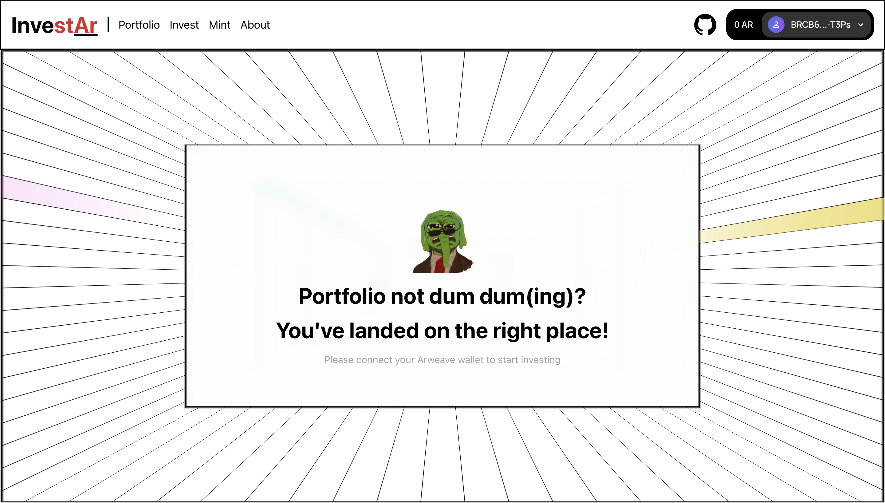

# DeltaFi - Autonomous Trading Bot

DeltaFi is an autonomous trading bot built on the ao protocol that monitors multiple DEXes on Arweave for profitable trading opportunities. The platform automatically executes trades when it detects price differences between exchanges, capturing profit without manual intervention.



## Features

- **Automated Arbitrage**: Constantly monitors DEXes for price discrepancies
- **Cross-DEX Trading**: Executes trades across different exchanges to capture profit
- **Configurable Parameters**: Set slippage tolerance and minimum profit thresholds
- **Token Pair Selection**: Choose which token pairs to monitor
- **Real-Time Profit Tracking**: Monitor your arbitrage profits and execution history
- **DEX Integration**: Works with multiple Arweave-based decentralized exchanges

## Tech Stack

- **Frontend**: Next.js 14, TypeScript, Tailwind CSS
- **Blockchain**: Arweave Network, AO Protocol
- **Smart Contracts**: Lua
- **Wallet Integration**: Arweave Wallet Kit
- **UI Components**: Radix UI, Framer Motion

## Getting Started

### Prerequisites

- Node.js (v18 or higher)
- Arweave Wallet
- Git

### Installation

1. Clone the repository:
```bash
git clone https://github.com/dharminnagar/deltafi.git
cd deltafi
```

2. Install dependencies:
```bash
npm install
```

3. Run the development server:
```bash
npm run dev
```

4. Open [http://localhost:3000](http://localhost:3000) in your browser

### Environment Setup

No additional environment variables are required for basic setup. The application uses default Arweave configurations.

## Usage

1. **Connect Wallet**: Use the connect button in the header to link your Arweave wallet
2. **Configure Bot**: Set up your arbitrage strategy with:
   - Input/Target tokens
   - Maximum allowance amount
   - Slippage tolerance
3. **Start Bot**: Click "Start Arbitrage Bot" to begin monitoring DEXes
4. **Monitor Profits**: View details of arbitrage executions and profits in real-time 
5. **Stop Bot**: Click "Stop Arbitrage Bot" when you want to pause operations

## Project Structure

```
deltafi/
├── app/                   # Next.js app directory
├── components/            # React components
├── lib/                   # Utility functions and configurations
├── lua/                   # Arbitrage agent Lua code
│   └── ArbitrageAgent/    # Core agent logic
├── public/                # Static assets
└── styles/                # Global styles
```

## Contributing

1. Fork the repository
2. Create your feature branch (`git checkout -b feature/AmazingFeature`)
3. Commit your changes (`git commit -m 'Add some AmazingFeature'`)
4. Push to the branch (`git push origin feature/AmazingFeature`)
5. Open a Pull Request

## Team

- **Dharmin Nagar** - [GitHub](https://github.com/dharminnagar) | [Twitter](https://twitter.com/dharminnagar)
- **Yatharth Singh Panwar** - [GitHub](https://github.com/yatharth-singh-panwar) | [Twitter](https://twitter.com/yatharthpnwr)

## License

This project is licensed under the MIT License - see the [LICENSE](LICENSE) file for details.

## Acknowledgments

- Arweave Network
- AO Protocol
- The entire Web3 community
